# Class Diagram Komprehensif - Sistem Informasi Manajemen Gudang

## Keterangan Diagram

Class diagram ini menunjukkan struktur lengkap aplikasi warehouse management sistem yang mencakup:
- **Models Layer**: Representasi data dan business logic
- **Controllers Layer**: Handler untuk HTTP requests dan responses
- **Commands Layer**: Background processes dan scheduled tasks
- **External Dependencies**: Package-package yang digunakan

## Mermaid Class Diagram Script

```mermaid
classDiagram
    %% =====================
    %% MODELS LAYER
    %% =====================
    
    class User {
        +int id
        +string name
        +string email
        +timestamp email_verified_at
        +string password
        +string remember_token
        +timestamp created_at
        +timestamp updated_at
        
        +hasRole(role) boolean
        +assignRole(role) void
        +syncRoles(roles) void
        +histories() HasMany
    }
    
    class Barang {
        +string kode (PK)
        +string nama
        +string satuan
        +timestamp created_at
        +timestamp updated_at
        
        +barangMasuk() HasMany
        +barangKeluar() HasMany
        +stok() HasMany
        +opname() HasMany
    }
    
    class BarangMasuk {
        +int id
        +string barang_kode (FK)
        +int qty
        +int harga
        +date tanggal
        +string keterangan
        +timestamp created_at
        +timestamp updated_at
        
        +barang() BelongsTo
    }
    
    class BarangKeluar {
        +int id
        +string barang_kode (FK)
        +int tempat_id (FK)
        +int qty
        +int harga
        +date tanggal
        +string keterangan
        +timestamp created_at
        +timestamp updated_at
        
        +barang() BelongsTo
        +tempat() BelongsTo
    }
    
    class Stok {
        +int id
        +string barang_kode (FK)
        +int tempat_id (FK)
        +int jumlah
        +timestamp created_at
        +timestamp updated_at
        
        +barang() BelongsTo
        +tempat() BelongsTo
    }
    
    class Opname {
        +int id
        +string barang_kode (FK)
        +int tempat_id (FK)
        +int stok_sistem
        +int stok_lapangan
        +int selisih
        +date periode_awal
        +date periode_akhir
        +string keterangan
        +timestamp created_at
        +timestamp updated_at
        
        +barang() BelongsTo
        +tempat() BelongsTo
    }
    
    class Tempat {
        +int id
        +string nama
        +timestamp created_at
        +timestamp updated_at
        
        +barangKeluar() HasMany
        +stok() HasMany
        +opname() HasMany
        +statusTempat() HasMany
    }
    
    class StatusTempat {
        +int id
        +int tempat_id (FK)
        +decimal total
        +date periode_awal
        +date periode_akhir
        +enum status (loading|done)
        +timestamp created_at
        +timestamp updated_at
        
        +tempat() BelongsTo
    }
    
    class History {
        +int id
        +int user_id (FK)
        +string action
        +string model_type
        +int model_id
        +json changes
        +timestamp created_at
        +timestamp updated_at
        
        +user() BelongsTo
    }
    
    %% =====================
    %% CONTROLLERS LAYER
    %% =====================
    
    class Controller {
        <<abstract>>
        +middleware(middleware) void
        +validate(request, rules) array
        +authorize(ability, arguments) void
    }
    
    class DashboardController {
        +index() View
        -calculateDashboardStats() array
        -getTransactionSummary() array
    }
    
    class BarangController {
        +index() View
        +create() View
        +store(request) RedirectResponse
        +edit(barang) View
        +update(request, barang) RedirectResponse
        +destroy(barang) RedirectResponse
        -validateBarangData(request) void
    }
    
    class BarangMasukController {
        +index() View
        +create() View
        +store(request) RedirectResponse
        +show(id) View
        +edit(id) View
        +update(request, id) RedirectResponse
        +destroy(id) RedirectResponse
        +exportExcel() BinaryFileResponse
        -processBarangMasuk(data) void
        -updateStok(barangKode, qty) void
    }
    
    class BarangKeluarController {
        +index() View
        +create() View
        +store(request) RedirectResponse
        +show(id) View
        +edit(id) View
        +update(request, id) RedirectResponse
        +destroy(id) RedirectResponse
        +exportExcel() BinaryFileResponse
        -processBarangKeluar(data) void
        -updateStok(barangKode, tempat, qty) void
    }
    
    class OpnameController {
        +index() View
        +data(request) JsonResponse
        +create() View
        +store(request) RedirectResponse
        +show(id) View
        +edit(id) View
        +update(request, id) RedirectResponse
        +destroy(id) RedirectResponse
        +exportExcel() BinaryFileResponse
        -calculateOpnamePeriod() array
        -processOpnameData(data) void
    }
    
    class TempatController {
        +index() View
        +create() View
        +store(request) RedirectResponse
        +edit(tempat) View
        +update(request, tempat) RedirectResponse
        +destroy(tempat) RedirectResponse
    }
    
    class UserController {
        +index() View
        +create() View
        +store(request) RedirectResponse
        +edit(user) View
        +update(request, user) RedirectResponse
        +destroy(user) RedirectResponse
        -assignUserRole(user, role) void
    }
    
    class RekapLaporanController {
        +index() View
        +data(request) JsonResponse
        +refresh() RedirectResponse
        +toggleStatus(request, statusTempat) RedirectResponse
        -buildRekapQuery(filters) Builder
    }
    
    class LaporanPerTempatController {
        +index() View
        +data(request) JsonResponse
        -buildLaporanQuery(tempat, dates) Builder
    }
    
    class HistoryController {
        +index() View
    }
    
    class DataMissController {
        +index() View
        +data(request) JsonResponse
        -buildDataMissQuery(filters) Builder
    }
    
    %% =====================
    %% COMMANDS LAYER
    %% =====================
    
    class Command {
        <<abstract>>
        +string signature
        +string description
        +handle() int
        +info(message) void
        +error(message) void
    }
    
    class GenerateOpnameReport {
        +string signature = "opname:generate"
        +string description = "Generate opname report for current period"
        +handle() int
        -calculateOpnamePeriod() array
        -processOpnameForPeriod(startDate, endDate) void
        -generateOpnameRecords(tempat, periode) void
    }
    
    class GenerateStatusTempatReport {
        +string signature = "statustempat:generate"
        +string description = "Generate status tempat report for current period"
        +handle() int
        -calculateCurrentPeriod() array
        -calculateTempatTotal(tempat, periode) decimal
        -updateStatusTempat(tempat, total, periode) void
    }
    
    %% =====================
    %% EXTERNAL PACKAGES
    %% =====================
    
    class Authenticatable {
        <<interface>>
    }
    
    class HasRoles {
        <<trait>>
    }
    
    class SoftDeletes {
        <<trait>>
    }
    
    class LogsActivity {
        <<trait>>
    }
    
    class DataTables {
        <<facade>>
        +of(query) DataTableBuilder
        +make(true) JsonResponse
    }
      class Carbon {
        <<class>>
        +today() Carbon
        +parse(date) Carbon
        +format(format) string
    }
    
    class Hash {
        <<facade>>
        +make(value) string
        +check(value, hash) boolean
    }
    
    class Artisan {
        <<facade>>
        +call(command) int
    }
    
    %% =====================
    %% RELATIONSHIPS
    %% =====================
    
    %% Model Relationships
    User o-- History : "creates"
    User --|> Authenticatable : "implements"
    User --|> HasRoles : "uses"
    
    Barang o-- BarangMasuk : "has many"
    Barang o-- BarangKeluar : "has many"
    Barang o-- Stok : "has many"
    Barang o-- Opname : "has many"
    
    Tempat o-- BarangKeluar : "has many"
    Tempat o-- Stok : "has many"
    Tempat o-- Opname : "has many"
    Tempat o-- StatusTempat : "has many"
    
    BarangMasuk o-- Barang : "belongs to"
    BarangKeluar o-- Barang : "belongs to"
    BarangKeluar o-- Tempat : "belongs to"
    Stok o-- Barang : "belongs to"
    Stok o-- Tempat : "belongs to"
    Opname o-- Barang : "belongs to"
    Opname o-- Tempat : "belongs to"
    StatusTempat o-- Tempat : "belongs to"
    History o-- User : "belongs to"
    
    %% Controller Inheritance
    DashboardController --|> Controller : "extends"
    BarangController --|> Controller : "extends"
    BarangMasukController --|> Controller : "extends"
    BarangKeluarController --|> Controller : "extends"
    OpnameController --|> Controller : "extends"
    TempatController --|> Controller : "extends"
    UserController --|> Controller : "extends"
    RekapLaporanController --|> Controller : "extends"
    LaporanPerTempatController --|> Controller : "extends"
    HistoryController --|> Controller : "extends"
    DataMissController --|> Controller : "extends"
    
    %% Command Inheritance
    GenerateOpnameReport --|> Command : "extends"
    GenerateStatusTempatReport --|> Command : "extends"
    
    %% Controller Dependencies
    DashboardController ..> Barang : "uses"
    DashboardController ..> BarangMasuk : "uses"
    DashboardController ..> BarangKeluar : "uses"
    DashboardController ..> Stok : "uses"
    
    BarangController ..> Barang : "uses"
    
    BarangMasukController ..> BarangMasuk : "uses"
    BarangMasukController ..> Barang : "uses"
    BarangMasukController ..> Stok : "uses"
    
    BarangKeluarController ..> BarangKeluar : "uses"
    BarangKeluarController ..> Barang : "uses"
    BarangKeluarController ..> Tempat : "uses"
    BarangKeluarController ..> Stok : "uses"
    
    OpnameController ..> Opname : "uses"
    OpnameController ..> Barang : "uses"
    OpnameController ..> Tempat : "uses"
    OpnameController ..> Stok : "uses"
    OpnameController ..> DataTables : "uses"
    OpnameController ..> Carbon : "uses"
    
    TempatController ..> Tempat : "uses"
    
    UserController ..> User : "uses"
    UserController ..> Hash : "uses"
    
    RekapLaporanController ..> StatusTempat : "uses"
    RekapLaporanController ..> Tempat : "uses"
    RekapLaporanController ..> DataTables : "uses"
    RekapLaporanController ..> Artisan : "uses"
    
    LaporanPerTempatController ..> BarangKeluar : "uses"
    LaporanPerTempatController ..> Tempat : "uses"
    LaporanPerTempatController ..> DataTables : "uses"
    
    HistoryController ..> History : "uses"
    
    DataMissController ..> Opname : "uses"
    DataMissController ..> DataTables : "uses"
    
    %% Command Dependencies
    GenerateOpnameReport ..> Barang : "uses"
    GenerateOpnameReport ..> Tempat : "uses"
    GenerateOpnameReport ..> Stok : "uses"
    GenerateOpnameReport ..> Opname : "uses"
    GenerateOpnameReport ..> Carbon : "uses"
    
    GenerateStatusTempatReport ..> Tempat : "uses"
    GenerateStatusTempatReport ..> StatusTempat : "uses"
    GenerateStatusTempatReport ..> BarangKeluar : "uses"
    GenerateStatusTempatReport ..> Carbon : "uses"
    
    %% Models using traits
    History --|> LogsActivity : "uses"
    StatusTempat --|> LogsActivity : "uses"
```

## Penjelasan Komponen

### Models Layer
- **User**: Model untuk manajemen pengguna dengan role-based access
- **Barang**: Model master data barang dengan kode sebagai primary key
- **BarangMasuk/BarangKeluar**: Model untuk transaksi masuk dan keluar
- **Stok**: Model untuk tracking stok per tempat
- **Opname**: Model untuk stock opname dengan perhitungan selisih
- **Tempat**: Model master data lokasi penyimpanan
- **StatusTempat**: Model untuk tracking status opname per tempat
- **History**: Model untuk audit trail semua aktivitas

### Controllers Layer
- **DashboardController**: Menangani dashboard dengan ringkasan data
- **BarangController-BarangKeluarController**: CRUD operations untuk transaksi
- **OpnameController**: Menangani stock opname dengan export Excel
- **RekapLaporanController**: Laporan rekap dengan toggle status
- **LaporanPerTempatController**: Laporan per lokasi dengan filtering
- **DataMissController**: Laporan data yang hilang/selisih
- **HistoryController**: Menampilkan audit trail
- **UserController**: Manajemen user dan role

### Commands Layer
- **GenerateOpnameReport**: Background task untuk generate opname otomatis
- **GenerateStatusTempatReport**: Background task untuk update status tempat

### External Dependencies
- **Spatie Permission**: Untuk role dan permission management
- **Yajra DataTables**: Untuk server-side processing tabel
- **Carbon**: Untuk manipulasi tanggal
- **Laravel Excel**: Untuk export Excel (implisit)

## Catatan Implementasi

1. **Separation of Concerns**: Setiap layer memiliki tanggung jawab yang jelas
2. **Repository Pattern**: Controller tidak langsung mengakses database
3. **Command Pattern**: Background processes terpisah dari web requests
4. **Observer Pattern**: History logging menggunakan model events
5. **Facade Pattern**: Menggunakan Laravel facades untuk akses services

Diagram ini menunjukkan arsitektur lengkap sistem yang mengikuti best practices Laravel dan design patterns yang tepat untuk warehouse management system.
